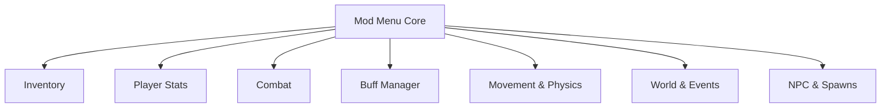

## Overview

Terraria Mod Menu is an in-game overlay interface designed to expose editable systems of **Terraria** during active gameplay. The menu groups player stats, inventory containers, combat parameters, world states, and entity logic into modular panels with toggles, sliders, and numeric inputs. All changes apply in memory, updating values live while keeping base assets untouched. Preset profiles allow repeatable configurations for sandbox testing, modded runs, or controlled scenario setup.

---

## Inventory & Item Management Panel

* Edit item slots, stack sizes, and quantities
* Inject items directly into inventory or hotbar
* Lock stacks to prevent consumption
* Category filters for weapons, blocks, and materials

**Feature intent:**
Writes directly to inventory slot data, bypassing crafting, drop, and pickup logic.

---

## Player Stats & Survival Controls

* Set or freeze health and mana values
* Infinite health and infinite mana toggles
* Regeneration rate adjustment
* Optional soft caps for balance testing

**In-game behavior:**
Overrides per-tick stat updates to enforce configured values or regeneration rules.

---

## Combat & Damage Modifiers

* Outgoing damage multipliers
* Incoming damage reduction or nullification
* Defense and knockback tuning
* Attack speed adjustments (engine-dependent)

**Feature intent:**
Intercepts combat resolution to substitute damage and defense coefficients before application.

---

## Buffs, Debuffs & Status Manager

* Apply buffs with custom duration
* Instantly remove debuffs
* Lock active buffs to prevent expiry
* Toggle immunities for selected status effects

**In-game behavior:**
Manages the active status list by adding, removing, or resetting timers in real time.

---

## Movement & Physics Overrides

* Speed and acceleration scaling
* Jump height and gravity modifiers
* Disable fall damage
* Optional collision or clip behavior (where supported)

**Feature intent:**
Adjusts physics variables used by movement integration to alter traversal constraints.

---

## World, Time & Event Controls

* Control time-of-day and progression speed
* Force day or night states
* Trigger or suppress invasions and events
* Toggle biome-related world flags (where accessible)

**In-game behavior:**
Modifies world-state counters and flags that drive environmental logic and events.

---

## NPC, Spawn & Entity Management

* Adjust spawn rates and caps
* Freeze or slow hostile AI updates
* Clear nearby hostile entities
* Relocate entities (engine-limited)

**Feature intent:**
Targets spawn managers and entity update loops to control encounter density and behavior.

---

## Hotkeys, Presets & Menu Routing

* Assign hotkeys to individual toggles
* Save and load preset profiles
* Favorites and quick-access routing
* Session-safe module enable/disable

**In-game behavior:**
Provides a consistent control surface that can be restored across sessions while isolating features.

---

---

## FAQ

**Is the mod menu displayed in-game?**
Yes. It runs as an overlay that can be opened and closed during play.

**Do changes apply immediately?**
Most adjustments take effect instantly; some world or event changes apply on the next tick.

**Can inventory stacks be locked?**
Yes. Stack locking prevents items from decreasing on use.

**Does it modify game files?**
No. The design operates in memory during runtime.

**Can configurations be reused?**
Preset profiles allow consistent setups across sessions.

**Are spawn rates and hostile density adjustable?**
Spawn rate and cap controls are available where engine access permits.

---

## Feature Summary

* In-game overlay mod menu with modular panels
* Inventory editing and item injection
* Health/mana control with regeneration and freeze options
* Combat modifiers for damage, defense, and knockback
* Buff/debuff application and duration locking
* Movement and physics overrides
* World time, events, and NPC/spawn management
